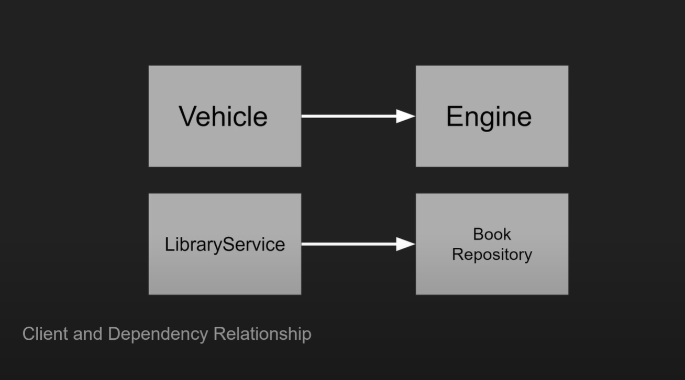
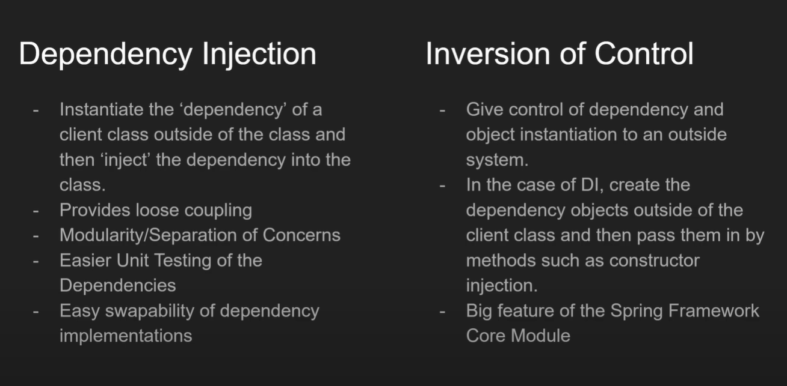

#Dependency Injection & Inversion of control

###Dependency Injection
- A class depends upon another class to function

###Loose coupling 
- pass /injecting object through constructor 0r constructor

###Tight coupling
- crete an object inside the class

### Inversion Of Control
- giving control of the dependency and object instantiation to an outside system means we are inverting control.

### Service
- A class perform which perform some define function with in the business logic of your application

###Bussiness Logic
- the code make your application function which does stuff.

