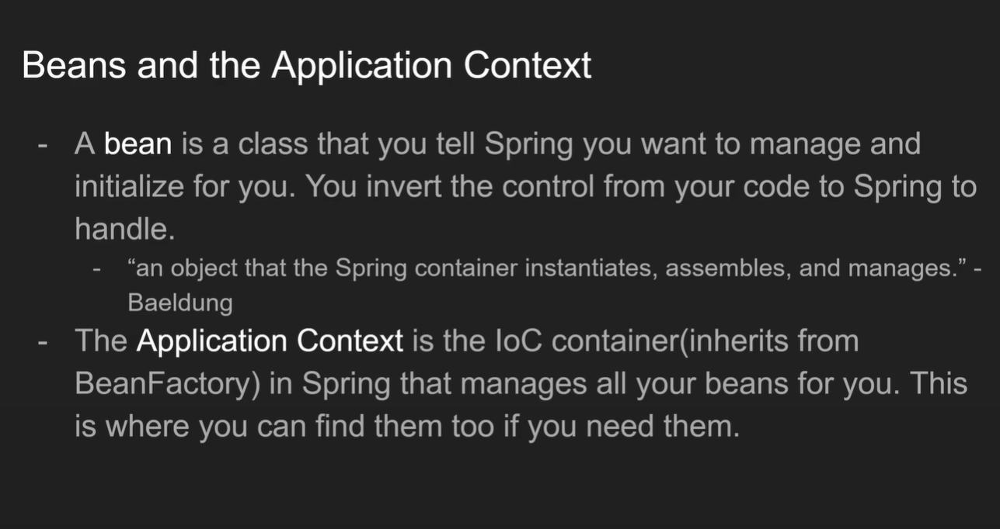

###Beans
A class spring will manage for us

###ApplicationContext
It is a Inversion of Control container
Beans are located in ApplicationContext
We use to access our bean

###Sterotype / Java Anottation

###The following recognize/ manage/inject class as bean

###@Componet

###@Repository 
- pick by spring data

###@Controller 
- pick by spring web framework to manage as bean

###@Service

###@RestController - for rest controller